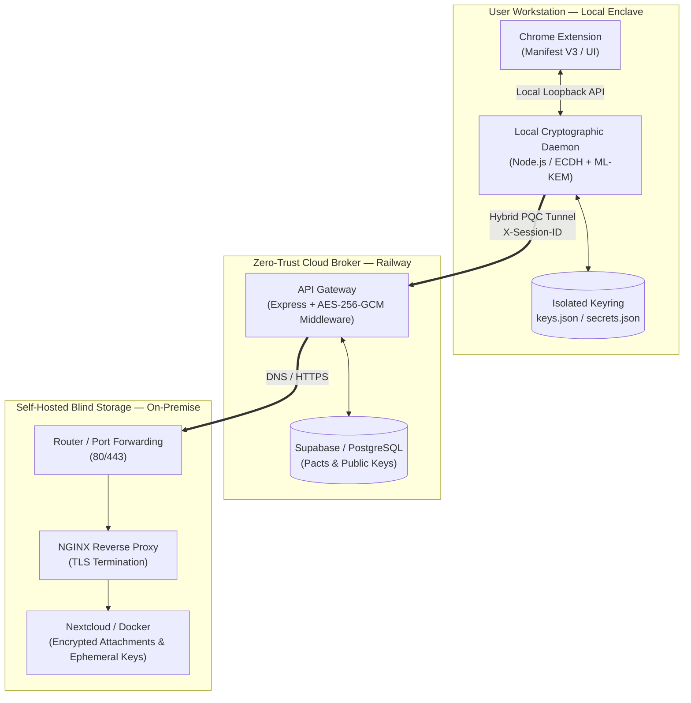

# Mail Signer PQC — Post-Quantum Hybrid E2E Authentication Architecture

[](https://opensource.org/licenses/MIT)
[](#security--cryptographic-design)
[](#infrastructure--networking)

An end-to-end (E2E) cryptographic verification system designed to authenticate emails and attachments against **spoofing, Man-in-the-Middle (MitM)**, and **"Harvest Now, Decrypt Later" (HNDL)** quantum computing threats.

This repository serves as an **architectural blueprint and engineering showcase**. It documents a decentralized Zero-Trust system combining:

* A local cryptographic security enclave
* An application-level hybrid post-quantum cryptography (PQC) handshake
* Ephemeral key management and Forward Secrecy
* A stateless cloud relay
* Self-hosted encrypted attachment storage

---

## Technical Notice & Scope

> **Architectural Showcase Only — Offline State**
>
> This project was developed as an academic proof-of-concept at **ESIEE Paris**.
>
> The live demonstration infrastructure is **permanently offline and non-operational**:
>
> * The central broker hosted on Railway has been shut down.
> * The on-premise Nextcloud instance has been decommissioned.
> * Domain resolution and network tunnels have been removed.
>
> Executing this code against the original external services will therefore fail.
>
> The objective of this repository is strictly to **expose the system architecture, protocol logic, cryptographic implementation, and engineering decisions** for review and security auditing.

---

## Current Status & Improvement Vectors

Development was frozen after completion of the academic defense.

The following table summarizes the state of the system at project termination and the engineering improvements identified for a potential production implementation.

| Functional Area           | State at Freeze                                                                  | Engineering Remediation                                                                                                 |
| :------------------------ | :------------------------------------------------------------------------------- | :---------------------------------------------------------------------------------------------------------------------- |
| **Identity & Compliance** | User registration and active session keys operational; no account deletion flow. | Expose GDPR-compliant account destruction endpoints with cascading PQC key-ring revocation across peers.                |
| **Execution Flow**        | Signing and sending actions are decoupled in the DOM.                            | Consolidate them into an atomic **"Sign & Dispatch"** routine to eliminate orphan key derivation in memory.             |
| **Storage Hygiene**       | Crashed or interrupted transmissions may leave orphan files on Nextcloud.        | Deploy an automated Garbage Collector during crash recovery to purge dead session keys and orphaned files.              |
| **Daemon Hardening**      | Master key files are written using standard local user permissions.              | Enforce OS-level DAC/MAC isolation with exclusive Administrator/Root permissions on the runtime keyring directory.      |
| **Device Topology**       | Strict **One Account = One Device** binding due to local key generation.         | Implement local peer-to-peer (P2P) synchronization between trusted machines without server-side key escrow.             |
| **Transport Layer**       | Application-level cryptographic wrapping over TLS 1.3 due to PaaS constraints.   | Migrate to native Hybrid TLS 1.3 using ML-KEM through OpenSSL 3.x when supported by the target Node.js LTS environment. |

---

## System Architecture & Network Flow

The system is divided into four isolated security zones in order to minimize the exposure of master and session secrets on external networks.



### Security Zones

The architecture separates responsibilities across four distinct zones:

1. **Client Interface**

   * Chrome Extension
   * Gmail DOM integration
   * Message normalization
   * Local attachment hashing

2. **Local Security Enclave**

   * Cryptographic key generation
   * Message signing
   * Hybrid ECDH + ML-KEM operations
   * Session key derivation
   * Forward Secrecy enforcement

3. **Zero-Trust Cloud Broker**

   * Stateless routing
   * Session authentication
   * Public-key exchange
   * No plaintext message decryption

4. **Self-Hosted Blind Storage**

   * Encrypted attachment storage
   * SHA-256 attachment hashes
   * Ephemeral key pools
   * NGINX reverse proxy
   * Docker-based infrastructure

---

## Component Breakdown

### Client Interface — `/extension`

The Chrome Extension provides the user-facing interface and integrates cryptographic operations into Gmail.

Main responsibilities include:

* Injecting operational panels into the Gmail DOM using `MutationObserver`
* Detecting relevant Gmail interface elements
* Normalizing email text content
* Computing local SHA-256 attachment digests using `crypto.subtle`
* Communicating with the local cryptographic daemon through a loopback API

The extension operates as a **Manifest V3** application using Chrome Service Workers where required.

---

### Local Security Enclave — `/daemon`

The local daemon acts as a software-based **Hardware Security Module (HSM) abstraction** running on the user's workstation.

Its responsibilities include:

* Generating cryptographic key pairs
* Performing ECDH operations
* Performing ML-KEM operations
* Signing normalized messages
* Deriving symmetric session keys
* Managing ephemeral communication keys
* Destroying used keys to enforce Forward Secrecy
* Maintaining the local cryptographic keyring

The daemon is intentionally isolated from the public network whenever possible.

---

### Cloud Broker — `/cloud-api`

The cloud API is designed as a **stateless Zero-Trust routing gateway**.

Its responsibilities include:

* Validating session tokens
* Routing encrypted payloads
* Exchanging public-key material
* Managing session metadata
* Relaying communication between clients and the self-hosted storage layer

The broker is not intended to possess the plaintext required to decrypt protected message content.

---

### Self-Hosted Storage — `/infra`

The storage layer is deployed on a self-hosted infrastructure using Docker.

It provides:

* Nextcloud-based encrypted file storage
* Ephemeral key storage
* Attachment hash storage
* NGINX reverse proxying
* TLS termination
* Docker Compose orchestration

The storage server is treated as **blind storage** rather than a trusted cryptographic endpoint.

---

# Security & Cryptographic Design

## Hybrid Key Encapsulation

The session establishment mechanism combines classical and post-quantum cryptography.

The hybrid handshake combines:

* **ECDH P-256**
* **ML-KEM-768**
* **HKDF-SHA-256**
* **AES-256-GCM**

The resulting shared secrets are combined through HKDF to derive the symmetric session key used for authenticated encryption.

Conceptually:

```text
ECDH(P-256)
     │
     ├──────────────┐
     │              │
     ▼              │
Shared Secret A     │
                    │
ML-KEM-768          │
     │              │
     ▼              │
Shared Secret B     │
     │              │
     └──────┬───────┘
            ▼
       HKDF-SHA-256
            │
            ▼
     AES-256-GCM Key
```

This hybrid construction is intended to preserve security even if one of the underlying cryptographic assumptions is compromised.

---

## Application-Layer Cryptographic Tunnel

Because the original deployment environment presented limitations around experimental post-quantum TLS support, the project implemented an **application-level cryptographic wrapper over TLS 1.3**.

The goal was to ensure that sensitive application data remained cryptographically protected even if transport-layer traffic were captured.

This design specifically addresses the **Harvest Now, Decrypt Later (HNDL)** threat model.

> **Important:** The application-level tunnel should not be interpreted as a replacement for a properly configured post-quantum or hybrid TLS deployment. Native hybrid TLS should be preferred when the target infrastructure provides mature and interoperable support.

---

## Asynchronous Forward Secrecy

Communication pacts use batches of ephemeral, single-use PQC keys.

The prototype allocates:

```text
100 single-use PQC keys
        │
        ▼
   Communication Pact
        │
        ├── Key #0 → Transaction 1
        ├── Key #1 → Transaction 2
        ├── Key #2 → Transaction 3
        ├── ...
        └── Key #99 → Transaction 100
```

For each transaction:

1. A single ephemeral key is allocated.
2. The transaction is authenticated.
3. The key is consumed.
4. The used key is deleted locally.
5. The corresponding remote key material is invalidated after successful verification.

This design limits the impact of a potential compromise of a single ephemeral session key.

---

## Deterministic Message Normalization

Before hashing or signing, message content is normalized to avoid cross-platform verification inconsistencies.

The normalization process handles formatting differences such as:

```text
\r\n
  ↓
\n
```

This prevents differences in line endings or other formatting artifacts from producing different cryptographic digests for semantically identical messages.

The normalized representation is then used as the canonical input for subsequent hashing and signature verification.

---

## Attachment Integrity

Attachments are hashed locally using SHA-256.

The resulting digest acts as an integrity identifier:

```text
Attachment
    │
    ▼
SHA-256
    │
    ▼
Attachment Digest
    │
    ├── Stored as verification metadata
    └── Compared during verification
```

The system therefore verifies attachment integrity without requiring the storage infrastructure to become a trusted cryptographic authority.

---

## Ephemeral Key Pool

The storage layer can hold XOR-masked ephemeral key material using the conceptual construction:

```text
C = K ⊕ S
```

Where:

* `K` = key material
* `S` = masking secret
* `C` = stored masked value

The masking mechanism is intended to reduce the value of stored material when considered independently from the corresponding secret.

> This construction should not be considered a substitute for authenticated encryption or a formally analyzed key-management scheme in a production system.

---

# Infrastructure & Networking

## Multi-Container Topology

The storage infrastructure uses Docker Compose to orchestrate the required services.

The original architecture included:

* **Nextcloud** — file storage
* **PostgreSQL** — database
* **Redis** — caching/session support
* **NGINX** — reverse proxy and TLS termination

Conceptually:

```text
Internet
   │
   ▼
Residential Router
   │
   │ 80 / 443
   ▼
NGINX Reverse Proxy
   │
   ├───────────────┐
   ▼               ▼
Nextcloud      Other Services
   │
   ├── PostgreSQL
   └── Redis
```

---

## Edge Routing & Hardening

The original self-hosted ingress layer relied on NGINX.

Responsibilities included:

* Reverse proxying
* TLS termination
* Let's Encrypt certificate management
* HSTS headers
* HTTP/HTTPS routing
* Port forwarding from the residential gateway

The production architecture would require additional hardening, including strict firewall policies, OS-level isolation, secret management, logging, monitoring, and secure backup procedures.

---

## Database Maintenance

The backend included periodic maintenance workers designed to remove expired session keys.

The conceptual cleanup operation was:

```sql
DELETE FROM session_keys
WHERE expires_at < NOW();
```

The purpose of this mechanism is to limit:

* Database growth
* Memory consumption
* Stale session material
* Long-term retention of ephemeral cryptographic data

In a production environment, this mechanism should be complemented by database indexes, transactional cleanup, monitoring, and failure recovery procedures.

---

# Repository Structure

```text
.
├── extension/                  # Chrome Extension
│                                # Manifest V3, Service Workers, UI Injection
│
├── daemon/                     # Local Node.js Cryptographic Enclave
│                                # ECDH / ML-KEM engine
│
├── cloud-api/                  # Railway Backend
│                                # Express.js / Zero-Trust Middleware
│
├── infra/                      # Docker Compose & NGINX templates
│   ├── README.md
│   ├── docker-compose.example.yml
│   └── nginx.example.conf
│
└── README.md
```

---

# Code Inspection — Local Mock

The original live infrastructure is no longer available.

However, the repository can still be inspected locally to review the implementation and architecture.

## 1. Daemon Dependencies & Structure

Navigate to the daemon directory:

```bash
cd daemon
npm install
```

> **Note:** Server initialization requires the appropriate mock configuration files. The original production infrastructure is offline.

---

## 2. Extension Artifacts

Open Google Chrome and navigate to:

```text
chrome://extensions/
```

Then:

1. Enable **Developer mode**.
2. Select **Load unpacked**.
3. Select the `/extension` directory.
4. Open Gmail or the relevant local test environment.
5. Inspect the injected UI and DOM observers through Chrome Developer Tools.

The extension's UI components and DOM observers can therefore be reviewed without relying on the original cloud infrastructure.

---

# Threat Model

The architecture was designed around several major threat categories.

| Threat                                  | Mitigation                                               |
| :-------------------------------------- | :------------------------------------------------------- |
| **Email spoofing**                      | Cryptographic signatures and identity-bound verification |
| **Man-in-the-Middle (MitM)**            | Hybrid key establishment and authenticated encryption    |
| **Harvest Now, Decrypt Later**          | Application-level PQC protection using ML-KEM            |
| **Attachment tampering**                | Local SHA-256 integrity verification                     |
| **Session key compromise**              | Ephemeral single-use key material                        |
| **Cloud compromise**                    | Zero-Trust/stateless broker architecture                 |
| **Storage compromise**                  | Encrypted attachments and blind-storage model            |
| **Key reuse**                           | Explicit key consumption and deletion                    |
| **Cross-platform normalization issues** | Deterministic message normalization                      |

---

# Design Principles

The project is built around the following principles:

### Zero Trust

No external infrastructure is assumed to be inherently trustworthy.

### Local Key Ownership

Long-term cryptographic material is generated and retained on the user's workstation rather than escrowed by the cloud broker.

### Cryptographic Separation of Duties

The extension, local daemon, cloud broker, and storage infrastructure have distinct responsibilities.

### Ephemeral Cryptographic Material

Session-level keys are designed to be short-lived and single-use whenever possible.

### Blind Infrastructure

The cloud and storage layers should not require access to plaintext message content to perform their routing and storage functions.

### Post-Quantum Readiness

ML-KEM is incorporated into the key-establishment architecture to address future quantum threats and the HNDL attack model.

---

# Limitations

This repository represents an **academic proof-of-concept**, not a production-ready secure email platform.

Important limitations include:

* The original demonstration infrastructure is permanently offline.
* The project has not undergone an independent formal security audit.
* The local daemon is a software security enclave rather than a hardware-backed HSM.
* The original deployment relied on application-level PQC wrapping rather than native hybrid TLS.
* Account deletion and complete GDPR lifecycle management were incomplete.
* Multi-device synchronization was not implemented.
* Crash recovery and orphan-file cleanup required further engineering.
* Runtime keyring permissions required stronger OS-level isolation.
* Production deployment would require additional operational security controls.

---

# Future Work

Potential next steps for a production-oriented implementation include:

* Native hybrid TLS 1.3 with ML-KEM
* Hardware-backed key storage
* Secure multi-device synchronization
* Complete GDPR account lifecycle management
* Automated crash recovery and garbage collection
* Formal protocol verification
* Independent cryptographic audit
* Secure key rotation
* Stronger device attestation
* Centralized security monitoring
* Reproducible builds
* Supply-chain security controls
* Automated integration and security testing

---

# Academic Context

**Mail Signer PQC** was developed as an academic proof-of-concept at **ESIEE Paris**.

The project explores the practical integration of:

* Post-quantum cryptography
* Hybrid key establishment
* End-to-end authentication
* Zero-Trust architecture
* Local cryptographic enclaves
* Ephemeral key management
* Secure attachment verification
* Self-hosted infrastructure

The repository is intended primarily as an **engineering and architectural showcase** for technical review, experimentation, and security analysis.

---
